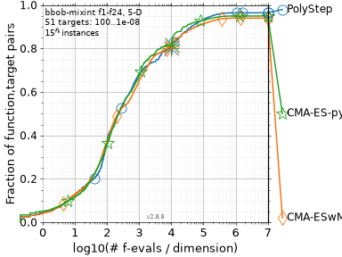
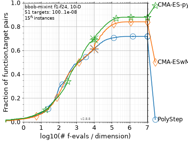

# Benchmarks

## bbob-mixint

The COCO [`bbob-mixint`](https://numbbo.github.io/coco/testsuites/bbob-mixint) suite
([Tušar et al., GECCO 2019](https://hal.inria.fr/hal-02067932)) has 24 functions in
which 80% of the variables are integers with 2 to 16 values. CMA-ES is known to stall
there because its step size shrinks below the integer grid; CMA-ES with margin
([Hamano et al., GECCO 2022](https://arxiv.org/abs/2205.13482)) fixes that with a lower
bound on the marginal probabilities. PolyStep keeps a finite radius, so it is a natural
candidate for this suite.

Setup: dimensions 5 and 10, instances 1-15, one run per instance, budget `10^4 * dim`.
PolyStep uses `PolyStepES` with box bounds, a `repair` that rounds the integer
coordinates, a geometric radius decay and uniform restarts. Its three parameters
(`epsilon = 0.1`, initial radius = mean box width, decay 0.95) were tuned on dimension 20,
which is not in the table. The baselines are the archived COCO runs of CMA-ES with
margin (2022) and pycma (2019), not tuned here. The script, the tuning grid and the
run instructions are in [`benchmark/`](https://github.com/anindex/PolyStep.jl/tree/main/benchmark).

Fraction of (function, instance, target) triples solved, 51 targets from `10^2` to
`10^-8`, within `100`, `1000` and `10^4` evaluations per dimension:

| dim | group | PolyStep | CMA-ES with margin | CMA-ES (pycma) |
|---|---|---|---|---|
| 5 | all | **.37** / **.68** / .80 | **.37** / .65 / .81 | .36 / .67 / **.82** |
| 5 | separable | .52 / .83 / .89 | **.62** / .87 / **1.0** | .55 / **.91** / **1.0** |
| 5 | multimodal | **.26** / **.62** / **.84** | .25 / .58 / .80 | .23 / .59 / .80 |
| 5 | multimodal, weak structure | **.27** / **.49** / **.64** | .22 / .40 / .58 | .24 / .43 / .62 |
| 10 | all | **.29** / **.49** / .61 | .24 / .48 / .62 | .22 / .49 / **.69** |
| 10 | separable | .45 / .59 / .78 | **.46** / **.77** / .85 | .31 / .75 / **.90** |
| 10 | multimodal | **.17** / **.47** / .56 | .14 / .41 / .53 | .14 / .35 / **.66** |
| 10 | multimodal, weak structure | **.23** / **.26** / .39 | .13 / .18 / .45 | .16 / .22 / **.49** |

Reading:

- Up to `1000 * dim` evaluations PolyStep solves about as many targets as the better CMA-ES
  variant or more, in both dimensions; the lead comes from the multimodal groups.
- At `10^4 * dim` it ties CMA-ES with margin and trails pycma, clearly so in dimension 10.
- It is weakest on separable functions, where the CMA-ES variants reach every target in
  dimension 5. The conditioning groups (not shown) are mixed; the script prints the full
  table.

This is a small pilot (15 runs per function and dimension), not a claim of superiority.
The figures are COCO's runtime ECDFs; beyond each algorithm's budget (the cross) cocopp
extends the curves with simulated restarts.

## Examples

The five scripts in [`examples/`](https://github.com/anindex/PolyStep.jl/tree/main/examples)
compare PolyStep with tuned baselines on OR and decision-focused-learning problems; the
results are summarized on the [home page](index.md).
